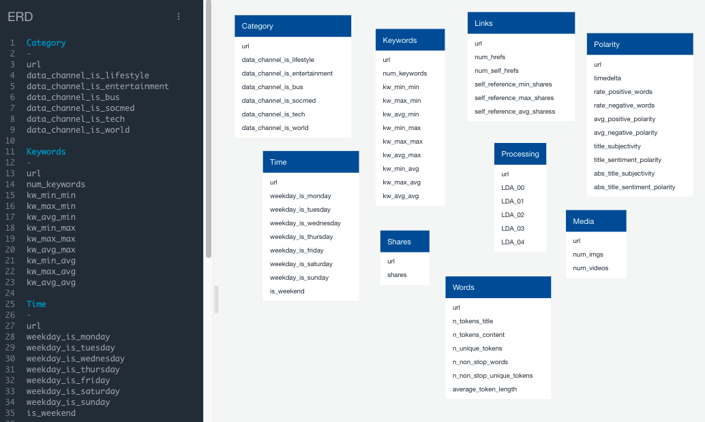

# Online_News_Project

## Selected Topic: Online News Popularity

### [Link to Google Slides](https://docs.google.com/presentation/d/17hTziRvz6Hiwmy3satv0QTVF8MOqUpNktrlUoLgleyA/edit?usp=sharing)

## Group Members:

* Bailey Lantrip (Mockup Database) 
* David Gae (Machine Learning Model)
* Maddie Back (Technology)
* Melanie Kelsey (Machine Learning Model) 
* Michelle Morrison (Repository) 
* Rachel Krasner (Mockup Database)

### Description of communication protcols:

We are using our Slack project channel, our GitHub repository, and Zoom as necessary - sometimes with all 6 of us and sometimes grouped by our role for the week.

### Reason we selected it: 

We had 2 former ideas, one of which had data that was too outdated and the latter had a data source without enough rows to successfully put through Machine Learning. With how much we're all inundated with news on various platforms each day, this dataset piqued our interest as something relevant and intriguing. 

### Description of the data source:

David identified an excellent source from the UCI Machine Learning Repository: [Link](https://archive.ics.uci.edu/ml/datasets/Online+News+Popularity). This is one of their 422 available data sets. It's from 2015 and has about 40,000 rows of data, which will be ideal for training and test sets. 58 of the 61 columns can be used as possible predictive topics, 2 are non-predictive, and 1 column is the goal field of # of shares.

### Project Outline

1. **Introduction to Project**
    * Selected Topic & Why
    * Description of datasource
    * Questions to be Answered in our Presentation
    * Overview of data exploration & analysis 
2. **Database Integration**
    * Created Postgres database hosted by AWS
    * Connected PgAdmin to our RDS instance (news-data)
    * Uploaded our clean data into AWS S3 bucket
    * Started a Spark session to write into Postgres database
    * Using PySpark, we read in our S3 link and loaded into a DataFrame
    * Performed transformations on the DataFrame to match the AWS tables
    * Connected to the database and loaded into the tables
4. **Develop data in Pandas Python file:**
    * Read csv dataset into Pandas Dataframe
    * Remove any unnecessary columns
    * Bucket "shares" column into bins for measuring "popularity." 
    * Split data into Training and Test sets
    * Define our features
    * Train the model
    * Fit the model
    * Make predictions
    * Calculate the confusion matrix
    * Calculate the balanced accuracy score
    * Print the imbalanced classification report
5. **Develop visualizations to tell our story**
    * Graph showing Words in the Title vs. Popularity
    * Graph showing Day Published vs. Popularity
    * Graph showing Polarity vs. Popularity
    * Graph showing Positive/Negative Rate vs. Popularity
    * Graph showing # Images vs. Popularity

### Database Integration:
After opening the orginal csv file and taking a look at the general structure, we determined that a good place to begin is by building an Entity Relational Diagram (ERD) as seen below:

### Machine Learning Model

A big part of our preprocessing was honing in on the columns we wanted to keep of the original 61 columns. We kept the main ones pertaining to token count, included images, days of publication, positive/negative rating, polarity, and number of shares - which brought the column count down to 25. From here, we bucketed the "shares" column into "Shareable" and "Not Shareable" based on the number of shares that fell into the 75th percentile or higher. 

We used the generic "Train Test Split" code to split our 40,000 rows of data into the default test size of 25% (10,000 rows) while the remaining 75% (30,000 rows) are used for training. After testing Logistic Regression and Random Forest, we ultimately decided to go with the Balanced Random Forest model for our project. This had the highest balanced accuracy score (of only 60%).

#### Data Limitations

We are realizing there might be an element of random chance when it comes to which articles will "go viral" and which will not. You can see from the screen shot below, there is no one predictor that stands out for accurately predicting popularity/shareability. Even when we reran the model with the top 3 and again with the top 7 attributes showing significance, the balanced accuracy score went down.

### Dashboard

We have a preliminary Tableau site up and running with 6 sheets and various visualizations. We will be narrowing them down in the coming weeks to flesh out final story. See link below.
### [Link to Tableau](https://public.tableau.com/app/profile/maddie4284/viz/Online_News_Popularity/Online_News?publish=yes)

### Technologies Used:

#### Data Cleaning and Analysis
Luckily the dataset we are using has all numeric values in the columns, so it will be an easier clean up process. To do the clean-up we will use pandas in ***Jupyter Lab***.   

#### Database Storage
We have decided to load the dataset into ***PGAdmin*** as the tool. Here we have created a relational database where we will create multiple tables for the separate information from the original dataset. 

#### Machine Learning
The many columns with different attributes can all be looked at as independent variables, which is why we want to use a Machine Learning Model that is built specifically for that. While a Regression Model can show us the relationship between the variables, we can also use a Clustering Model to see which attributes are most together. We have decided the ***clustering*** approach may be a good way to help visualize how these attributes group together. 

#### Dashboard
To present our findings, we will create visualizations on ***Tableau***. With this tool we can create different scatterplots and bar charts to show our findings to questions including (but not limited to). See Visualizations section above. 
